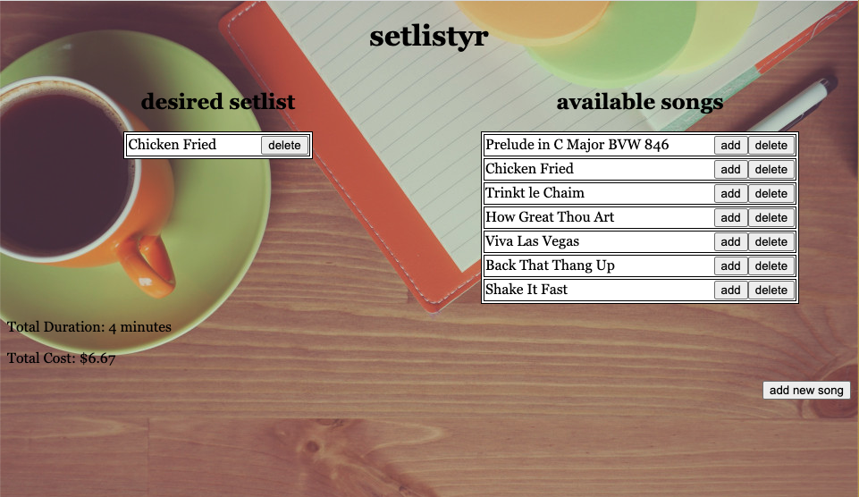

Setlystr
--

Hey musicians! Need a more efficient funnel for wedding clients? Setlystr is an intuitive way for potential clients to quickly interact with and build a setlist for their next event. Users can build a custom setlist based off of your known repertoire, and new songs can even be added by request!

Technologies used
--
* Node Package Manager
* Express
* Embedded Java Script
* CSS3
* Javascript
* Mongoose
* MongoDB

Screenshot
--

--
Getting Started
--

Try it out for yourself at [here](https://setlystr.herokuapp.com/setlist). New songs can be added to the musician's known repertoire (a feature that will eventually only be available from a seperate dashboard), and then subsequently be added to the client's desired setlist.

Future Enhancements
--
* Add client and musician authentication.
* Create a private dashboard for the musician.
* Link a music player to sample chosen repertoire.
